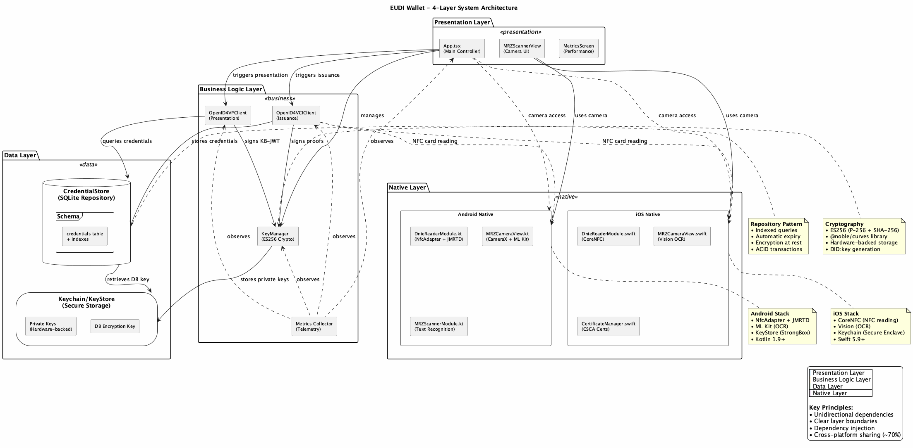
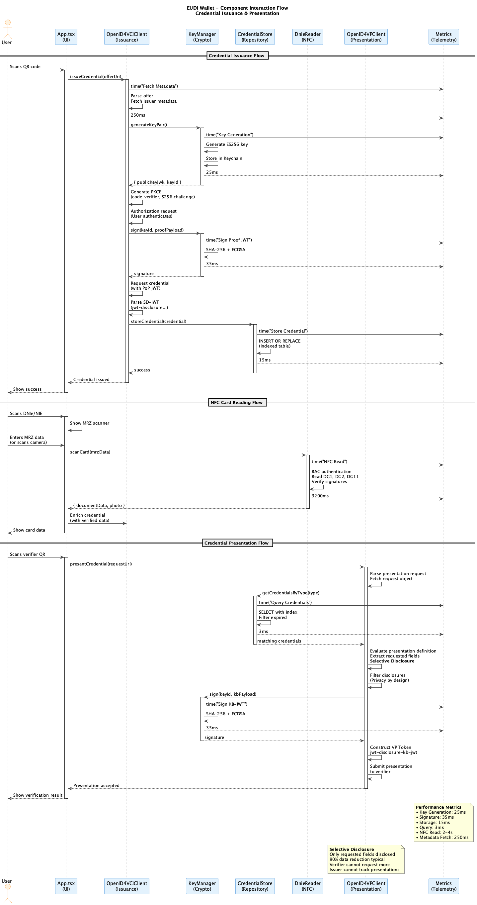
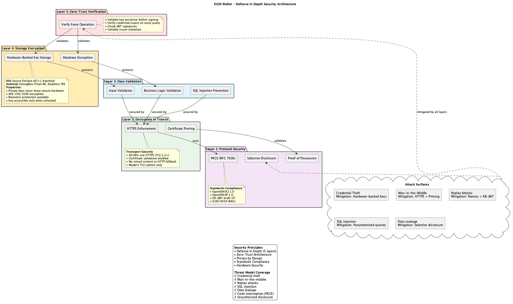

# Architecture Diagrams

This page contains the PlantUML diagrams for Article 2: EUDI Wallet Architecture.

## System Architecture

**4-Layer Architecture Overview:**
- Presentation Layer (React Native UI)
- Business Logic Layer (KeyManager, OpenID4VCI/VP)
- Data Layer (CredentialStore, Keychain/KeyStore)
- Native Layer (iOS Swift + Android Kotlin)

---

## Component Interaction

**Component Interaction Flows:**
- Credential issuance (OpenID4VCI)
- NFC card reading (DNIe/NIE with BAC)
- Credential presentation (OpenID4VP with selective disclosure)
- Performance timing metrics

---

## Security Layers

**Defense in Depth - 5 Security Layers:**
1. **Protocol Security:** PKCE, Proof of Possession, Selective Disclosure
2. **Encryption in Transit:** HTTPS, Certificate Pinning
3. **Data Validation:** Input validation, SQL injection prevention
4. **Storage Encryption:** Hardware-backed keys, Database encryption
5. **Zero-Trust Verification:** Validate every operation

---

[← Back to Article 2](README.md)
