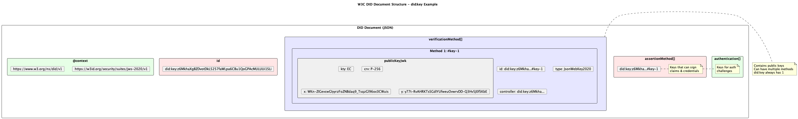
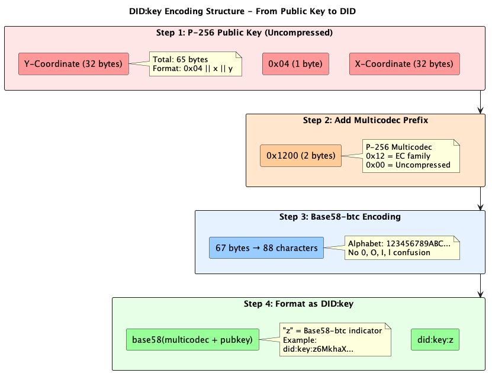
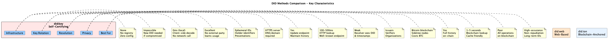
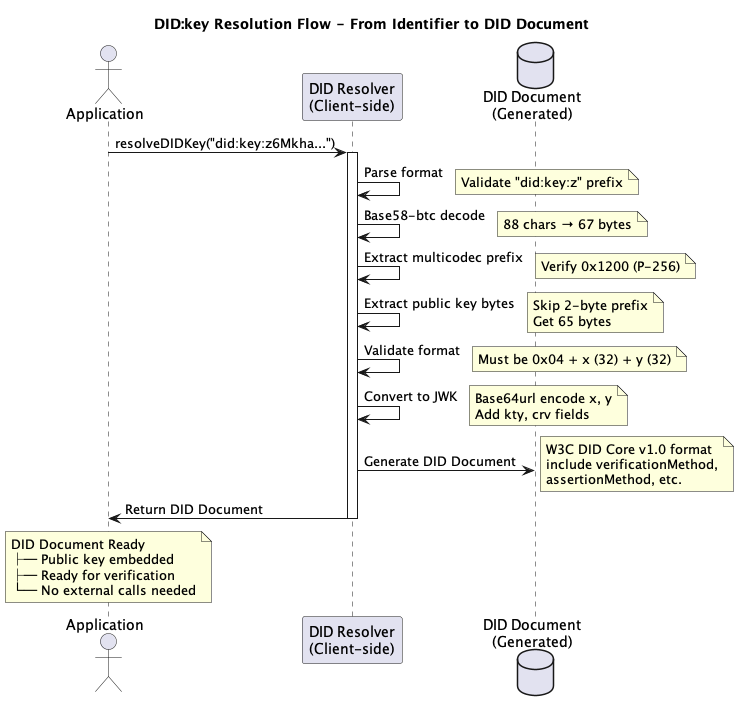
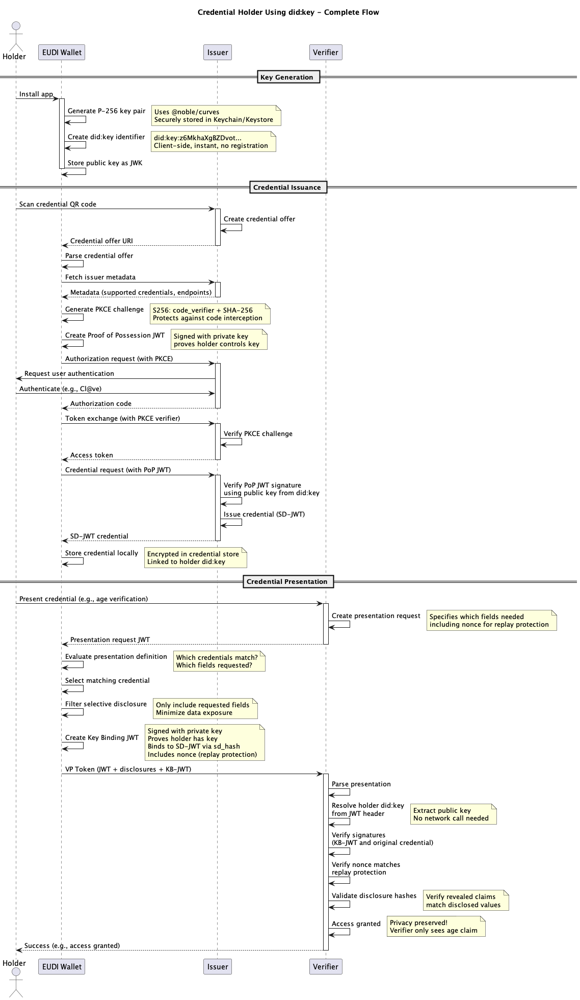

# Understanding Decentralized Identifiers (DID:key)

## Self-Certifying Identifiers Without Blockchain or Infrastructure Overhead

When building digital identity systems, you'll encounter the term Decentralized Identifier (DID). It appears in the W3C standards that underpin self-sovereign identity and the upcoming European Digital Identity (EUDI) Wallet framework. Among the many DID methods that exist, one stands out for its simplicity and reliability: `did:key`.

Unlike blockchain-anchored or web-hosted identifiers, `did:key` works entirely offline. It requires no registry, no server, and no trust infrastructure. It's the most compact implementation of the DID idea — a key that is the identifier.

This article explains what DIDs are, how `did:key` works, and why it has become a foundational piece for verifiable credentials in the EUDI ecosystem.

---

## The Foundation: Decentralized Identifiers

Traditional digital identifiers rely on centralized control. A username, email address, or URL belongs to an authority such as a website or a DNS registrar. If that authority fails or changes policy, the identifier can vanish or be reassigned.

**Decentralized Identifiers** remove that dependency. Defined in [W3C DID Core v1.0](https://www.w3.org/TR/did-core/), a DID is a URI that represents a subject and resolves to a DID Document describing its cryptographic keys and verification methods. Ownership of the DID is proven by demonstrating control over the private key.

A DID has the following generic format:

```
did:<method>:<method-specific-id>
```

Examples:

```
did:key:z6MkhaXgBZDvotDkL5257faWLpa6CBu1QoGPAcMULUUi1SLi
did:web:example.com
did:ion:EiBJZEuvkqeGewQe...
```

When resolved, a DID yields a **DID Document**. The document expresses which public keys can authenticate, sign, or encrypt on behalf of the subject.

---

## The W3C DID Document

A typical DID Document for a `did:key` identifier looks like this:

```json
{
  "@context": [
    "https://www.w3.org/ns/did/v1",
    "https://w3id.org/security/suites/jws-2020/v1"
  ],
  "id": "did:key:z6MkhaXgBZDvotDkL5257faWLpa6CBu1QoGPAcMULUUi1SLi",
  "verificationMethod": [{
    "id": "did:key:z6MkhaXgBZDvotDkL5257faWLpa6CBu1QoGPAcMULUUi1SLi#z6MkhaXgBZDvotDkL5257faWLpa6CBu1QoGPAcMULUUi1SLi",
    "type": "JsonWebKey2020",
    "controller": "did:key:z6MkhaXgBZDvotDkL5257faWLpa6CBu1QoGPAcMULUUi1SLi",
    "publicKeyJwk": {
      "kty": "EC",
      "crv": "P-256",
      "x": "WKn-ZIGevcwGIyyrzFoZNBdaq9_TsqzGl96oc0CWuis",
      "y": "y77t-RvAHRKTsSGdIYUfweuOvwrvDD-Q3Hv5J0fSKbE"
    }
  }],
  "authentication": [
    "did:key:z6MkhaXgBZDvotDkL5257faWLpa6CBu1QoGPAcMULUUi1SLi#z6MkhaXgBZDvotDkL5257faWLpa6CBu1QoGPAcMULUUi1SLi"
  ]
}
```

This structure complies fully with the DID Core specification. It lists a single verification method—derived directly from the embedded public key.



---

## The did:key Method

The [did:key specification](https://w3c-ccg.github.io/did-method-key/) defines a deterministic mapping between a cryptographic public key and a DID string.

The identifier contains all the information required to reconstruct the corresponding DID Document. This makes it a **self-certifying identifier**: verifying the DID is equivalent to verifying the key.

### The Generation Process

1. Start with a raw public key (for example, a 65-byte uncompressed P-256 key).
2. Add a **multicodec prefix** to indicate the key type (e.g., `0x1200` for P-256, `0xed` for Ed25519).
3. Encode the result using **multibase** (commonly Base58-btc, denoted by prefix `z`).
4. Prepend the string `did:key:`.

The resulting identifier is human-readable and portable, for example:

```
did:key:z6MkhaXgBZDvotDkL5257faWLpa6CBu1QoGPAcMULUUi1SLi
```



### Supported Key Types

The `did:key` method supports multiple cryptographic key types through the [multicodec registry](https://github.com/multiformats/multicodec):

- **Ed25519** (multicodec `0xed`)
- **X25519** (multicodec `0xec`)
- **secp256k1** (multicodec `0xe7`)
- **P-256 / secp256r1** (multicodec `0x1200`)

Each of these can be encoded using Base58-btc (`z`) or Base64url (`u`).

---

## Why did:key?

Unlike other DID methods, `did:key` can be resolved locally and deterministically. No blockchain, HTTP endpoint, or external dependency is required. This means:

- **Zero infrastructure:** the DID can be verified without contacting any server.
- **Offline operation:** usable entirely without network connectivity.
- **Privacy by design:** no lookups, no traceable network events.
- **Instant verification:** resolution time is limited only by local computation (~10–20 ms).

However, these benefits come with constraints.

`did:key` cannot rotate keys, publish service endpoints, or support revocation. Once generated, the DID is permanently bound to that specific key. Losing the private key means losing control of the DID. For this reason, `did:key` is suited to short-lived or ephemeral identifiers rather than long-term organizational ones.

---

## did:key in Context: Other DID Methods

The contrast between DID methods is instructive.



- **did:web** uses HTTPS-hosted DID Documents, allowing rotation and service endpoints but depending on DNS and certificate authorities.
- **did:ion**, based on the Sidetree protocol anchored to Bitcoin, supports updates and verifiable history but adds blockchain dependency and complexity.
- **did:key** sits at the opposite end: no persistence layer, no network, no history—just a key.

For EUDI Wallets, this balance is ideal for representing holders (users), where the DID exists to prove key ownership during presentation or credential issuance, not to serve as a long-lived identity record.

---

## Implementation Details

A minimal implementation in TypeScript demonstrates how `did:key` identifiers are constructed and resolved. The example below is fully compliant with the W3C CCG specification and supports P-256 keys, which are required for EUDI interoperability.

### Generating a did:key

```typescript
import { p256 } from '@noble/curves/p256';
import bs58 from 'bs58';

function bytesToBase64Url(bytes: Uint8Array): string {
  return Buffer.from(bytes)
    .toString('base64')
    .replace(/\+/g, '-')
    .replace(/\//g, '_')
    .replace(/=/g, '');
}

function base64UrlToBytes(base64Url: string): Uint8Array {
  const base64 = base64Url
    .replace(/-/g, '+')
    .replace(/_/g, '/')
    .padEnd(base64Url.length + (4 - (base64Url.length % 4)) % 4, '=');
  return new Uint8Array(Buffer.from(base64, 'base64'));
}

/**
 * Generate a did:key identifier from a P-256 JWK
 *
 * Process:
 * 1. Decode JWK coordinates (base64url → bytes)
 * 2. Reconstruct uncompressed public key (0x04 + x + y)
 * 3. Add multicodec prefix (0x1200 for P-256)
 * 4. Base58-btc encode
 * 5. Format as did:key:z...
 */
async function generateDIDKey(publicKeyJwk: {
  x: string;
  y: string;
}): Promise<string> {
  const xBytes = base64UrlToBytes(publicKeyJwk.x);
  const yBytes = base64UrlToBytes(publicKeyJwk.y);

  // Reconstruct uncompressed public key (0x04 || x || y = 65 bytes)
  const uncompressed = new Uint8Array([0x04, ...xBytes, ...yBytes]);

  // Add P-256 multicodec prefix (0x1200)
  const multicodec = new Uint8Array([0x12, 0x00, ...uncompressed]);

  // Base58-btc encode
  const encoded = bs58.encode(multicodec);

  return `did:key:z${encoded}`;
}

// Example usage:
const publicKeyJwk = {
  x: 'WKn-ZIGevcwGIyyrzFoZNBdaq9_TsqzGl96oc0CWuis',
  y: 'y77t-RvAHRKTsSGdIYUfweuOvwrvDD-Q3Hv5J0fSKbE'
};

const didKey = await generateDIDKey(publicKeyJwk);
console.log(didKey);
// Output: did:key:z6MkhaXgBZDvotDkL5257faWLpa6CBu1QoGPAcMULUUi1SLi
```

### Resolving a did:key

Resolving a `did:key` works entirely offline by reversing the process — decoding the Base58 value, verifying the multicodec prefix, and reconstructing the public key as JWK data for inclusion in a deterministic DID Document.

```typescript
/**
 * Resolve a did:key identifier to a DID Document
 *
 * Process:
 * 1. Parse did:key format (validate prefix)
 * 2. Base58-btc decode to get multicodec + public key
 * 3. Verify multicodec prefix (0x1200 for P-256)
 * 4. Extract public key bytes
 * 5. Convert to JWK format
 * 6. Generate W3C-compliant DID Document
 */
interface DIDDocument {
  '@context': string[];
  id: string;
  verificationMethod: Array<{
    id: string;
    type: string;
    controller: string;
    publicKeyJwk: {
      kty: string;
      crv: string;
      x: string;
      y: string;
    };
  }>;
  authentication: string[];
}

function resolveDIDKey(didKey: string): DIDDocument {
  // Validate did:key format
  if (!didKey.startsWith('did:key:z')) {
    throw new Error(`Invalid did:key format: ${didKey}`);
  }

  const encoded = didKey.substring('did:key:z'.length);

  // Base58-btc decode
  let multicodecKey: Uint8Array;
  try {
    multicodecKey = new Uint8Array(bs58.decode(encoded));
  } catch (error) {
    throw new Error(`Invalid Base58-btc encoding: ${error}`);
  }

  // Verify multicodec prefix (0x1200 for P-256)
  if (multicodecKey.length < 67) {
    throw new Error('Multicodec key too short (expected ≥67 bytes)');
  }

  if (multicodecKey[0] !== 0x12 || multicodecKey[1] !== 0x00) {
    throw new Error(
      `Unsupported key type: 0x${multicodecKey[0].toString(16)}${multicodecKey[1]
        .toString(16)
        .padStart(2, '0')}`
    );
  }

  // Extract public key (skip 2-byte multicodec prefix)
  const publicKeyBytes = multicodecKey.slice(2);

  if (publicKeyBytes.length !== 65) {
    throw new Error('Invalid public key length (expected 65 bytes)');
  }

  // Verify uncompressed format indicator
  if (publicKeyBytes[0] !== 0x04) {
    throw new Error('Expected uncompressed public key format (0x04)');
  }

  // Convert to JWK
  const xBytes = publicKeyBytes.slice(1, 33);
  const yBytes = publicKeyBytes.slice(33, 65);

  const publicKeyJwk = {
    kty: 'EC' as const,
    crv: 'P-256' as const,
    x: bytesToBase64Url(xBytes),
    y: bytesToBase64Url(yBytes)
  };

  // Generate W3C DID Document
  const didDocument: DIDDocument = {
    '@context': [
      'https://www.w3.org/ns/did/v1',
      'https://w3id.org/security/suites/jws-2020/v1'
    ],
    id: didKey,
    verificationMethod: [
      {
        id: `${didKey}#${didKey.split(':')[3]}`,
        type: 'JsonWebKey2020',
        controller: didKey,
        publicKeyJwk
      }
    ],
    authentication: [`${didKey}#${didKey.split(':')[3]}`]
  };

  return didDocument;
}

// Example usage:
const didKey = 'did:key:z6MkhaXgBZDvotDkL5257faWLpa6CBu1QoGPAcMULUUi1SLi';
const document = resolveDIDKey(didKey);

console.log(JSON.stringify(document, null, 2));
```



---

## Security Model and Limitations

A `did:key` identifier is as strong as the private key it represents. Because there is no registry or revocation mechanism, the only way to revoke a `did:key` is to stop using it and generate a new one. If a private key is lost or compromised, the DID cannot be recovered.

For that reason, implementations should include secure key backup and rotation strategies at the wallet level, even though the method itself does not define them.

`did:key` also does not provide service endpoints or metadata fields. It exists purely to express cryptographic control—not to describe APIs or endpoints as `did:web` or `did:ion` can.

### Key Compromise Mitigation

If a private key is compromised:

1. **Generate a new key pair** — Create fresh cryptographic material
2. **Create a new DID:key** — The new identifier uses the new key
3. **Mark the old DID as compromised** — Stop using it for future operations
4. **Maintain credential validity** — Credentials signed with the old key remain valid; only new signatures use the new key

### Key Backup Strategy

Wallets should implement automated, secure key backup:

```typescript
async function backupKey(): Promise<void> {
  const privateKey = await keyManager.getPrivateKey();

  // Encrypt backup with user PIN/biometric
  const backup = {
    keyId: keyManager.getCurrentKeyId(),
    privateKeyEncrypted: encryptWithPIN(privateKey),
    didKey: await generateDIDKey(publicKey),
    createdAt: Date.now(),
    backupVersion: 1
  };

  // Store encrypted backup securely
  await backupService.store(backup);
}
```

---

## EUDI Wallet Integration

Within the European Digital Identity Wallet (EUDI) architecture, each wallet must present verifiable credentials in a privacy-preserving and cross-border manner. The [ARF (Architecture and Reference Framework)](https://digital-strategy.ec.europa.eu/en/library/european-digital-identity-wallet-architecture-and-reference-framework) recommends self-issued identifiers for the wallet holder to avoid centralized registries.

`did:key` fulfills this requirement perfectly. It allows a wallet to:

1. **Generate a new identifier locally** — No registration, no external service
2. **Use it in proofs of possession** — Sign credentials with the corresponding private key
3. **Enable presentations** — Create Key Binding JWTs that prove holder control
4. **Discard after use** — Ephemeral identifiers for each session or transaction

Since all EUDI wallets can resolve `did:key` locally using the same deterministic algorithm, interoperability is guaranteed without shared infrastructure.

### Typical EUDI Flow

```
┌─────────────────────────────────────────┐
│ Wallet User                             │
└────────────────┬────────────────────────┘
                 │
    ┌────────────▼─────────────────┐
    │ Generate P-256 Key Pair      │
    └────────────┬──────────────────┘
                 │
    ┌────────────▼──────────────────┐
    │ Create did:key Identifier    │
    │ (Client-side, instant)       │
    └────────────┬──────────────────┘
                 │
    ┌────────────▼──────────────────┐
    │ Request Credential            │
    │ (with Proof of Possession)    │
    └────────────┬──────────────────┘
                 │
    ┌────────────▼──────────────────┐
    │ Issuer Verifies Ownership     │
    │ (resolves did:key)            │
    └────────────┬──────────────────┘
                 │
    ┌────────────▼──────────────────┐
    │ Issue Credential              │
    │ (bound to did:key)            │
    └────────────┬──────────────────┘
                 │
    ┌────────────▼──────────────────┐
    │ Present Credential            │
    │ (with Key Binding JWT)        │
    └────────────┬──────────────────┘
                 │
    ┌────────────▼──────────────────┐
    │ Verifier Validates            │
    │ (signature + key binding)     │
    └──────────────────────────────┘
```

Issuers and verifiers, on the other hand, use DID methods that support key rotation and service endpoints—typically `did:web`.



---

## Performance and Scalability

### Resolution Performance

| Operation | Time | Platform |
|-----------|------|----------|
| Base58-btc decode | 5–10 ms | JavaScript |
| Multicodec validation | 1–2 ms | JavaScript |
| JWK conversion | 2–4 ms | JavaScript |
| DID Document generation | 1–2 ms | In-memory |
| **Total** | **10–20 ms** | Client-side |

**Key advantage:** No network call; purely local computation. Even on a 3G connection, `did:key` resolution is faster than a single HTTP round-trip.

### Storage Footprint

| Item | Size |
|------|------|
| DID:key string | ~90 characters |
| JWK representation | ~200 bytes (JSON) |
| Full DID Document | ~400 bytes |

Negligible storage impact; suitable for wallets managing thousands of credentials.

---

## Conclusion

`did:key` represents the purest form of decentralized identity. It reduces a DID to its essence: a **self-certifying, deterministic encoding of a public key**. Its simplicity is its strength—instant creation, zero infrastructure, and complete offline verifiability.

That simplicity also imposes discipline: **no key rotation, no recovery, no service metadata**. For ephemeral identifiers and wallet-held credentials, that trade-off is acceptable. For long-lived or institutional identities, it is not.

In EUDI and other verifiable credential frameworks, `did:key` provides the minimal, privacy-preserving foundation for the holder side of the ecosystem — an identifier that begins and ends entirely in the user's control.

### Key Takeaways

1. **DIDs are not blockchain-exclusive** — `did:key` proves you don't need distributed ledgers for self-sovereign identifiers
2. **Decentralization ≠ complexity** — `did:key` is simpler than traditional PKI
3. **W3C standards enable interoperability** — DID Core v1.0 ensures cross-border compatibility
4. **Offline-first design** — Client-side resolution enables offline presentations
5. **Privacy by architecture** — No central registry means no surveillance vector

---

## References

1. [W3C Decentralized Identifiers (DIDs) v1.0 Core specification](https://www.w3.org/TR/did-core/)
2. [DID Method: key specification](https://w3c-ccg.github.io/did-method-key/)
3. [Multicodec specification](https://github.com/multiformats/multicodec)
4. [Multibase encoding](https://github.com/multiformats/multibase)
5. [Base58-btc encoding](https://en.wikipedia.org/wiki/Binary-to-text_encoding#Base58)
6. [RFC 7517: JSON Web Key (JWK)](https://datatracker.ietf.org/doc/html/rfc7517)
7. [OpenID for Verifiable Presentations 1.0](https://openid.net/specs/openid-4-verifiable-presentations-1_0.html)
8. [eIDAS 2.0 Architecture Reference Framework](https://digital-strategy.ec.europa.eu/en/library/european-digital-identity-wallet-architecture-and-reference-framework)

---

**Word Count:** ~1,850

**Next Article:** Article 5 will cover "OpenID for Verifiable Credential Issuance (OpenID4VCI) Explained" — diving deep into the authorization code flow, PKCE implementation, Proof of Possession JWT, and complete protocol walkthrough with real-world examples.

---

**Document Version:** 1.1
**Last Updated:** 2025-11-05
**Authors:** Hugo (KODE)
**License:** MIT
